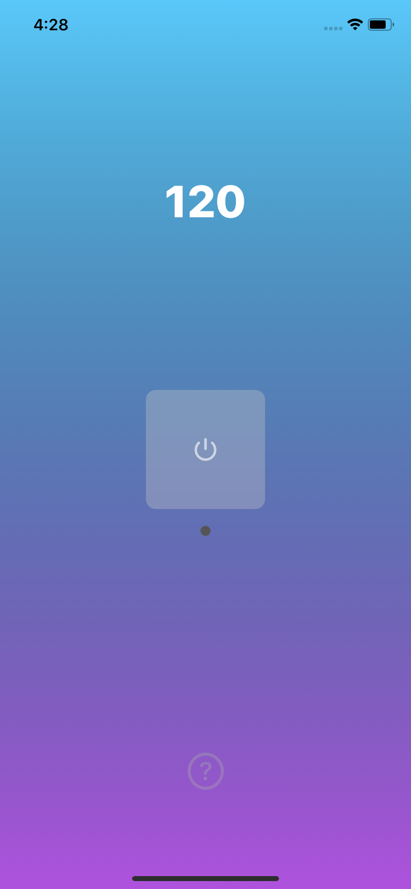
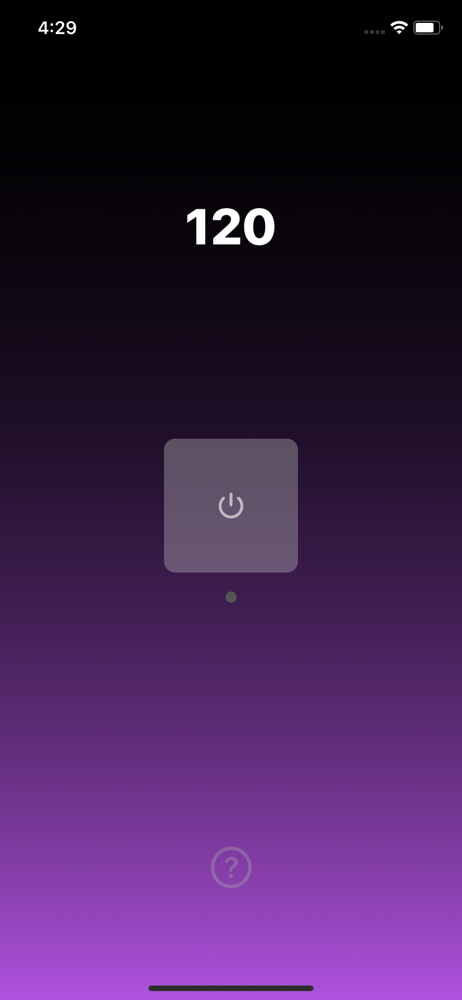
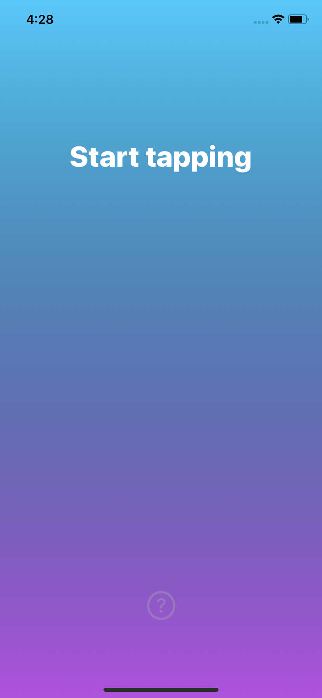
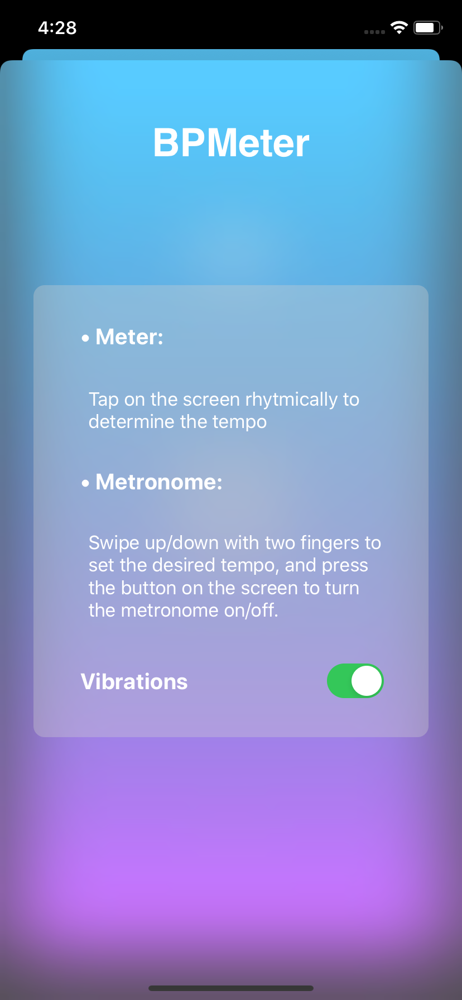
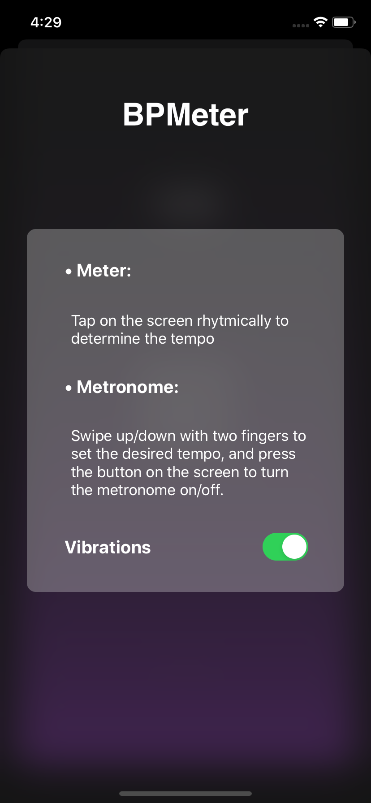

# BPMeter
A simple app featuring a tap tempo tool and a metronome for musicians.
Supports dark mode.

To guarantee a good experience, the clicks that the tools make are accompanied with audio and visual feedback as well as vibrations, which can be turned on/off.

Built using UIKit and Storyboards.

  
  
  
  
  

